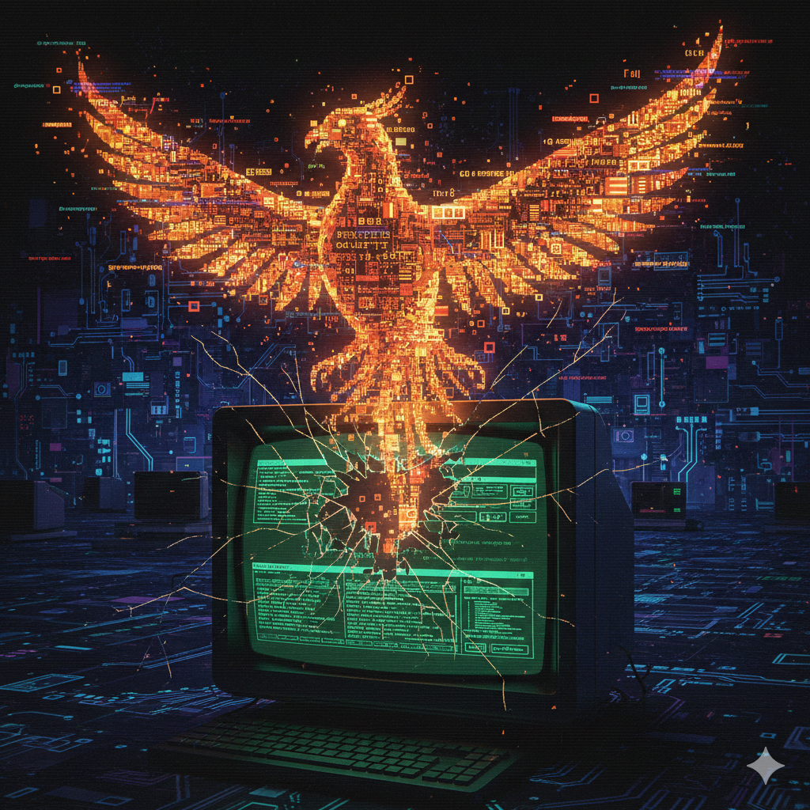

# Phoenix TUI Framework

<p align="center">
  
</p>

[](https://github.com/phoenix-tui/phoenix)
[](https://github.com/phoenix-tui/phoenix/releases)
[](https://github.com/phoenix-tui/phoenix/actions)
[](https://goreportcard.com/report/github.com/phoenix-tui/phoenix)
[](https://github.com/phoenix-tui/phoenix/blob/main/LICENSE)
[](https://pkg.go.dev/github.com/phoenix-tui/phoenix)

> **Multi-module monorepo** - 10 independent libraries. Full metrics in [CI](https://github.com/phoenix-tui/phoenix/actions).

> Next-generation Terminal User Interface framework for Go

**Organization**: [github.com/phoenix-tui](https://github.com/phoenix-tui)
**Go Version**: 1.25+

## Why Phoenix?

Phoenix rises from the ashes of legacy TUI frameworks, solving critical problems:

- **Perfect Unicode/Emoji support** - No more layout bugs
- **High Performance** - Differential rendering, caching, zero allocations
- **DDD Architecture** - Clean, testable, extendable
- **Rich Component Library** - Everything you need out of the box
- **Public Cursor API** - Full control for shell applications
- **Inline & Alt-Screen rendering** - Per-line diffing without alt screen, or full-screen mode
- **TTY Control** - Run editors, shells, and other processes from within your TUI
- **Easy Migration from Charm** - [Comprehensive migration guide](docs/user/MIGRATION_GUIDE.md) included

## Libraries

Phoenix is a modular framework with 10 independent libraries:

| Library | Description |
|---------|-------------|
| **[phoenix/core](core/)** | Terminal primitives, Unicode/Emoji support (correct width calculation) |
| **[phoenix/terminal](terminal/)** | ANSI terminal operations, raw mode, capabilities |
| **[phoenix/style](style/)** | CSS-like styling + Theme System (presets, runtime switching) |
| **[phoenix/layout](layout/)** | Flexbox & grid layout (box model, responsive sizing) |
| **[phoenix/tea](tea/)** | Elm Architecture + TTY Control + Inline Renderer |
| **[phoenix/render](render/)** | High-performance differential renderer |
| **[phoenix/components](components/)** | UI components: TextArea, TextInput, List, Viewport, Table, Modal, Progress, Select, MultiSelect, Confirm, Form |
| **[phoenix/mouse](mouse/)** | Mouse events (click, scroll, drag-drop, right-click) |
| **[phoenix/clipboard](clipboard/)** | Cross-platform clipboard (OSC 52 for SSH) |
| **[phoenix/testing](testing/)** | Mock terminal and test utilities |

## Installation

### Install All Libraries (Recommended for new projects)

```bash
go get github.com/phoenix-tui/phoenix@latest
```

This installs the umbrella module with convenient access to all Phoenix libraries through a single import:

```go
import "github.com/phoenix-tui/phoenix"

// Use convenience API
term := phoenix.AutoDetectTerminal()
style := phoenix.NewStyle().Foreground("#00FF00").Bold()
p := phoenix.NewProgram(myModel, phoenix.WithAltScreen[MyModel]())
```

### Install Individual Libraries (For existing projects or selective use)

```bash
go get github.com/phoenix-tui/phoenix/tea@latest        # Elm Architecture
go get github.com/phoenix-tui/phoenix/components@latest # UI Components
go get github.com/phoenix-tui/phoenix/style@latest      # Styling
go get github.com/phoenix-tui/phoenix/core@latest       # Terminal primitives
```

Individual imports give you more control and smaller dependencies:

```go
import (
    tea "github.com/phoenix-tui/phoenix/tea/api"
    "github.com/phoenix-tui/phoenix/components/input/api"
)
```

## Quick Start

### Using the Umbrella Module

```bash
go get github.com/phoenix-tui/phoenix@latest
```

```go
package main

import (
    "fmt"
    "os"
    "github.com/phoenix-tui/phoenix"
    tea "github.com/phoenix-tui/phoenix/tea/api"
)

type Model struct {
    count int
}

func (m Model) Init() tea.Cmd { return nil }

func (m Model) Update(msg tea.Msg) (Model, tea.Cmd) {
    switch msg := msg.(type) {
    case tea.KeyMsg:
        if msg.String() == "q" {
            return m, phoenix.Quit()
        }
        m.count++
    }
    return m, nil
}

func (m Model) View() string {
    style := phoenix.NewStyle().Foreground("#00FF00").Bold()
    return style.Render(fmt.Sprintf("Count: %d\n", m.count))
}

func main() {
    p := phoenix.NewProgram(Model{}, phoenix.WithAltScreen[Model]())
    if err := p.Run(); err != nil {
        fmt.Fprintf(os.Stderr, "Error: %v\n", err)
        os.Exit(1)
    }
}
```

### Using Individual Libraries

```bash
go get github.com/phoenix-tui/phoenix/tea@latest
```

```go
package main

import (
    "fmt"
    "os"
    "github.com/phoenix-tui/phoenix/tea/api"
)

type Model struct {
    count int
}

func (m Model) Init() api.Cmd { return nil }

func (m Model) Update(msg api.Msg) (Model, api.Cmd) {
    switch msg := msg.(type) {
    case api.KeyMsg:
        if msg.String() == "q" {
            return m, api.Quit()
        }
        m.count++
    }
    return m, nil
}

func (m Model) View() string {
    return fmt.Sprintf("Count: %d\nPress any key to increment, 'q' to quit\n", m.count)
}

func main() {
    p := api.New(Model{}, api.WithAltScreen[Model]())
    if err := p.Run(); err != nil {
        fmt.Fprintf(os.Stderr, "Error: %v\n", err)
        os.Exit(1)
    }
}
```

## Documentation

- **[MIGRATION_GUIDE.md](docs/user/MIGRATION_GUIDE.md)** - Migrate from Charm ecosystem (Bubbletea/Lipgloss/Bubbles)
- **[CHANGELOG.md](CHANGELOG.md)** - Version history and changes
- **[ROADMAP.md](ROADMAP.md)** - Public roadmap
- **[CONTRIBUTING.md](CONTRIBUTING.md)** - Development guide
- **[GoDoc](https://pkg.go.dev/github.com/phoenix-tui/phoenix)** - API reference for all modules

## Key Features

### 1. Perfect Unicode/Emoji Support

**Problem**: Charm's Lipgloss has broken emoji width calculation ([issue #562](https://github.com/charmbracelet/lipgloss/issues/562))
**Solution**: Phoenix uses grapheme cluster detection with correct East Asian Width (UAX #11)

```go
// Phoenix: CORRECT
text := "Hello 👋 World 🌍"
width := style.Width(text)  // Returns 17 (correct!)

// Charm Lipgloss: BROKEN
width := lipgloss.Width(text)  // Returns 19 (wrong!)
```

### 2. High Performance

**Techniques**: Differential rendering, virtual buffer, caching, zero allocations on hot paths

### 3. DDD Architecture

```
library/
├── domain/        # Business logic (highest coverage)
├── application/   # Use cases
├── infrastructure/ # Technical details
└── api/           # Public interface
```

### 4. Public Cursor API

**Problem**: Bubbles TextArea has private cursor - syntax highlighting impossible
**Solution**: Phoenix TextInput exposes `CursorPosition()` and `ContentParts()`

```go
// Phoenix: PUBLIC API (syntax highlighting works!)
before, at, after := input.ContentParts()
highlighted := syntax.Highlight(before) +
               cursor.Render(at) +
               syntax.Highlight(after)

// Bubbles: PRIVATE (syntax highlighting impossible!)
// cursor is internal field - no access
```

### 5. TTY Control

Run external processes (vim, shells, pagers) from within your TUI:

```go
case api.KeyMsg:
    if msg.String() == "e" {
        return m, api.ExecProcess("vim", "file.txt")
    }
case api.ExecProcessFinishedMsg:
    // Editor closed, TUI restored automatically
```

### 6. Inline Rendering

Run without alt screen - per-line diffing renders updates in place:

```go
p := api.New(myModel) // inline mode by default - no alt screen needed
```

### 7. Mouse & Clipboard Support

**Mouse**: All buttons (Left, Right, Middle, Wheel), drag-drop, click detection (single/double/triple)
**Clipboard**: Cross-platform (Windows/macOS/Linux), SSH support (OSC 52)

### 8. Progress Component

Progress bars and 15 animated spinner styles:

```go
import progress "github.com/phoenix-tui/phoenix/components/progress/api"

bar := progress.NewBar(100).SetWidth(40).SetLabel("Downloading").SetValue(65)
spinner := progress.NewSpinner(progress.SpinnerDots).SetLabel("Loading")
```

## Comparison with Charm Ecosystem

| Feature | Phoenix | Charm (Bubbletea/Lipgloss) |
|---------|---------|---------------------------|
| Unicode/Emoji | Correct width (UAX #11) | Broken ([#562](https://github.com/charmbracelet/lipgloss/issues/562)) |
| Type Safety | Generic constraints | `interface{}` casts |
| Inline Rendering | Per-line diffing | Basic |
| TTY Control | ExecProcess + Suspend/Resume | ExecProcess only |
| Cursor API | Public | Private |
| Architecture | DDD layers | Monolithic |
| Theme System | Built-in (4 presets) | Manual |

## Contributing

Phoenix is part of an active development effort. See [CONTRIBUTING.md](CONTRIBUTING.md) for contribution guidelines and [GoDoc](https://pkg.go.dev/github.com/phoenix-tui/phoenix) for API documentation.

## License

MIT License - see [LICENSE](LICENSE) file for details

## Special Thanks

**Professor Ancha Baranova** - This project would not have been possible without her invaluable help and support. Her assistance was crucial in bringing Phoenix to life.

---

*Rising from the ashes of legacy TUI frameworks*
