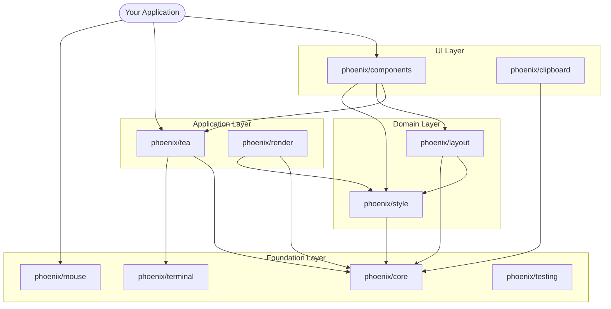
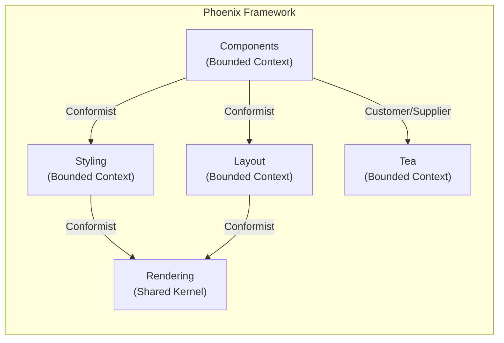

# Phoenix Architecture

> Technical architecture overview for developers and contributors.

---

## Principles

1. **Correctness** - High test coverage, type safety with generics, property-based testing for Unicode
2. **Performance** - Sub-16ms render time, zero allocations on hot paths, lazy evaluation
3. **Modularity** - Clean dependency graph, no cycles, interface-driven, hexagonal architecture
4. **Developer Experience** - Intuitive APIs, clear error messages, comprehensive examples

---

## Module Dependency Graph



### Dependency Layers

| Layer | Modules | Depends On |
|-------|---------|------------|
| **Foundation** | core, terminal, mouse | stdlib only (+ `golang.org/x/sys` for terminal) |
| **Domain** | style, layout, testing | Foundation |
| **Application** | render, tea | Foundation + Domain |
| **UI** | components, clipboard | All lower layers |

**Rule**: Lower layers NEVER depend on higher layers.

---

## DDD Layer Structure

Each Phoenix module follows Domain-Driven Design with clear layer separation:

```
module/
├── domain/              # Pure business logic (no external deps)
│   ├── model/          # Rich domain models with behavior
│   ├── value/          # Immutable value objects
│   ├── service/        # Domain services (stateless logic)
│   └── event/          # Domain events
│
├── application/         # Use cases and orchestration
│   ├── command/        # Command handlers (write operations)
│   └── query/          # Query handlers (read operations)
│
├── infrastructure/      # Technical implementation details
│   ├── ansi/           # ANSI escape sequences
│   ├── platform/       # OS-specific code
│   ├── cache/          # Caching strategies
│   └── renderer/       # Rendering infrastructure
│
└── api/                # Public interface (what users import)
    └── module.go       # Re-exports, fluent builders, convenience functions
```

### Layer Rules

- **Domain** - Zero dependencies on infrastructure or external packages. Pure Go. Highest test coverage.
- **Application** - Orchestrates domain objects. Depends on domain only (via interfaces).
- **Infrastructure** - Implements interfaces defined in domain/application. ANSI codes, OS calls, I/O.
- **API** - Thin facade over application layer. Provides ergonomic public types and functions.

### Domain Model Design

Phoenix uses **rich domain models** (not anemic DTOs):

```go
// Rich model — behavior lives WITH the data
type Style struct {
    fg      Color
    bg      Color
    bold    bool
    padding Padding
}

func (s Style) Bold() Style {
    s.bold = true
    return s  // Immutable — returns new instance
}

func (s Style) Render(text string) string {
    // Rendering logic encapsulated in the model
}
```

**Not** anemic models:

```go
// Anemic model — data bag with external service
type Style struct {
    FG, BG  string
    Bold    bool
}

// Logic lives in a separate "service" — violates DDD
func RenderStyle(s Style, text string) string { ... }
```

---

## Bounded Contexts



---

## Key Modules

### phoenix/core

Foundation primitives. Stdlib only (zero external dependencies for the core module).

- Unicode/Emoji width calculation (UAX #11 compliant)
- Grapheme cluster support
- Color types and conversion
- Terminal capability detection

### phoenix/terminal

ANSI terminal operations with platform abstraction.

- Raw mode / cooked mode
- Alternate screen buffer
- Cursor visibility and positioning
- Platform-specific backends (Windows Console, Unix termios)

### phoenix/tea

Elm Architecture (Model-View-Update) event loop.

- Generic `Model[T]` interface with compile-time type safety
- Command system (Quit, Batch, Sequence, custom)
- Input reader with pipe-based cancellation
- **InlineRenderer** — per-line diffing for non-alt-screen rendering
- TTY control — run external processes (ExecProcess), suspend/resume
- Platform support: Linux, macOS, Windows

### phoenix/style

CSS-like styling system.

- Fluent builder API (`NewStyle().Bold().Foreground("#FF0000")`)
- 8-stage rendering pipeline
- Theme system with presets and runtime switching
- Border, padding, margin support

### phoenix/layout

Flexbox and box model layout.

- Box model (padding, margin, border, content sizing)
- Flexbox (row/column direction, gap, flex grow/shrink)
- Responsive sizing (percentage, fixed, min/max)

### phoenix/render

High-performance differential renderer.

- Virtual buffer with dirty-region tracking
- Differential rendering (only repaint changed cells)
- Zero allocations on hot paths

### phoenix/components

Pre-built UI components, all following DDD:

- **TextArea** / **TextInput** — with public cursor API for syntax highlighting
- **List** — single/multi selection, filtering
- **Viewport** — scrolling, follow mode, large content support
- **Table** — sortable columns, custom cell renderers
- **Modal** — focus trap, buttons, dimming
- **Progress** — bar + 15 spinner styles
- **Select** / **MultiSelect** / **Confirm** / **Form** — form components with validation

### phoenix/mouse

Mouse event handling.

- All buttons (Left, Right, Middle, Wheel)
- Click detection (single/double/triple)
- Drag & drop state tracking
- Multi-protocol support (SGR, X10, URxvt)

### phoenix/clipboard

Cross-platform clipboard access.

- Native APIs (Windows user32.dll, macOS pbcopy/pbpaste, Linux xclip/xsel)
- OSC 52 for SSH sessions (auto-detect)
- DDD architecture with provider abstraction

---

## Rendering Architecture

### Alt-Screen Mode

Full terminal takeover. Uses phoenix/render's virtual buffer for differential rendering.

### Inline Mode

Non-alt-screen rendering via `InlineRenderer` in phoenix/tea:

```
Frame N:          Frame N+1:
┌──────────┐      ┌──────────┐
│ Line 1   │  →   │ Line 1   │  (unchanged — skipped)
│ Line 2   │  →   │ Line 2*  │  (changed — rewritten + erase-to-EOL)
│ Line 3   │  →   │          │  (removed — erase-screen-below)
└──────────┘      └──────────┘

Sequence: cursor-up(N-1) → \r → [per-line diff] → erase-below → \r
```

Features:
- Per-line diffing (skip unchanged lines)
- ANSI-preserving width truncation (color codes don't count)
- Height clipping (keeps output within terminal bounds)
- Thread-safe (mutex-protected)

---

## Testing Strategy

| Layer | Coverage Target | Testing Approach |
|-------|----------------|------------------|
| Domain | Highest | Unit tests, property-based, fuzzing |
| Application | High | Unit tests with mocked infrastructure |
| Infrastructure | Moderate | Integration tests, platform-specific |
| API | High | Example-based tests, ergonomics validation |

### Test Utilities

`phoenix/testing` provides mock terminal and test helpers:

```go
import phoenixtesting "github.com/phoenix-tui/phoenix/testing"

mockTerm := phoenixtesting.NewMockTerminal()
p := program.New(myModel, program.WithTerminal[MyModel](mockTerm))

// Verify terminal operations
assert.True(t, mockTerm.IsInRawMode())
assert.Equal(t, 1, mockTerm.CallCount("HideCursor"))
```

---

## Design Decisions

Key architectural decisions are documented in [docs/dev/decisions/](dev/decisions/).

Notable decisions:
- **DDD over MVC** — Phoenix is a foundational framework used by multiple projects; rich domain models provide better maintainability and testability
- **Multi-module monorepo** — Each module has its own `go.mod` for independent versioning; users install only what they need
- **No Charm dependencies** — Built from scratch to fix fundamental issues (Unicode, performance, architecture)
- **Generics for type safety** — Go 1.25+ generics eliminate `interface{}` casts in the Elm Architecture
- **Pipe-based stdin cancellation** — Platform-agnostic approach that works on Windows Console, MSYS2/mintty, and Unix

---

## Resources

- **[API Design](dev/API_DESIGN.md)** — API principles and comparison with Charm
- **[Migration Guide](user/MIGRATION_GUIDE.md)** — Migrate from Bubbletea/Lipgloss/Bubbles
- **[GoDoc](https://pkg.go.dev/github.com/phoenix-tui/phoenix)** — Full API reference

---

*Phoenix TUI Framework — DDD + Hexagonal Architecture + Modern Go*
